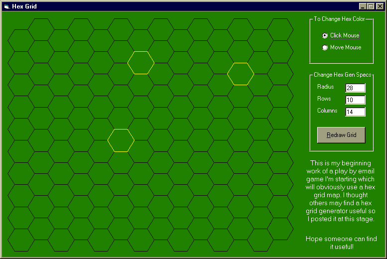



## Hex Grid Generator

### Description

I'm starting to create a fantasy play by email game which will use a hex grid map. So I've created a hex grid generator to assist me and I thought others could possibly find it useful too.
 
### More Info
 

             |
---                |---
**Submitted On**   |2001-06-02 09:22:18
**By**             |[JYoder](https://github.com/Planet-Source-Code/PSCIndex/blob/master/ByAuthor/jyoder.md)
**Level**          |Advanced
**User Rating**    |4.9 (34 globes from 7 users)
**Compatibility**  |VB 6\.0
**Category**       |[Games](https://github.com/Planet-Source-Code/PSCIndex/blob/master/ByCategory/games__1-38.md)
**World**          |[Visual Basic](https://github.com/Planet-Source-Code/PSCIndex/blob/master/ByWorld/visual-basic.md)
**Archive File**   |[Hex Grid G20442622001\.zip](https://github.com/Planet-Source-Code/jyoder-hex-grid-generator__1-23709/archive/master.zip)

